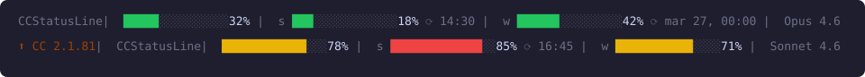
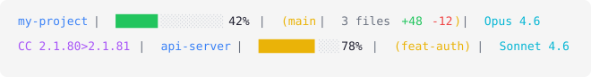
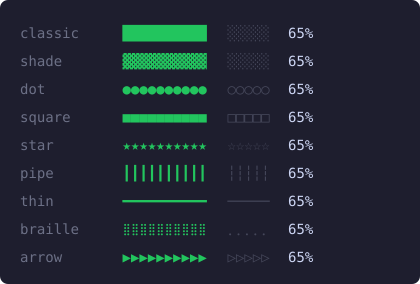
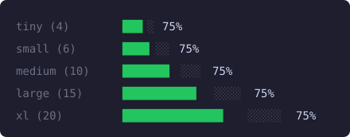
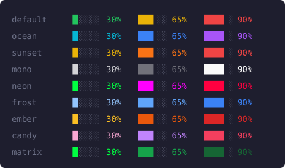

# YetAnotherCCStatusLine

A configurable, 4-line status line for [Claude Code](https://docs.anthropic.com/en/docs/claude-code). At a glance: where you are, what model you're on, how much context you've burned, and how close you are to the 5-hour and 7-day rate limits.

<p align="center">
  <br/>
  
</p>


## Layout

Four stacked lines, each conditional — empty rows collapse:

```
[⬆ CC 2.1.85 | ] dir | model [(1M)]
ctx <bar> NN% (Nk)
5h  <bar> NN% ⟳ HH:MM
7d  <bar> NN% ⟳ mon dd, HH:MM
```

## Features

- **Context window** — used % with a colored bar and absolute token count `(Nk)`. Accounts for Claude Code's auto-compact buffer so 100% means actually full. Pulses a `💀` at 80%+.
- **5-hour rate limit** — bar, percent, and reset time. Read live from Claude Code stdin (CC ≥ 2.1.80) with no API calls.
- **7-day rate limit** — same, with full reset date.
- **1M context tag** — `(1M)` suffix when the active model is on the 1M context window.
- **9 bar styles** — classic, shade, dot, square, star, pipe, thin, braille, arrow
- **5 bar sizes** — tiny (4), small (6), medium (10), large (15), xl (20)
- **9 color themes** — default, ocean, sunset, mono, neon, frost, ember, candy, matrix
- **Cross-session cache** — multiple Claude Code windows share one usage cache, so a freshly booted window shows real numbers before its first turn.
- Zero external dependencies (Node.js only).

## Installation

### macOS / Linux

```bash
curl -fsSL https://raw.githubusercontent.com/tylyp/YetAnotherCCStatusLine/main/install.sh | bash
```

### Windows (PowerShell)

```powershell
irm https://raw.githubusercontent.com/tylyp/YetAnotherCCStatusLine/main/install.ps1 | iex
```

Restart Claude Code and you're done.

## Bar Styles



## Bar Sizes



## Color Themes

Threshold-based coloring: **< 50%** low, **50–79%** mid, **80%+** high.



## Configuration

Copy `config.example.json` to `config.json` (or `~/.config/ccstatusline/config.json`) and edit:

```json
{
  "bar_size": "large",
  "bar_style": "classic",
  "theme": "default"
}
```

| Key         | Values | Default | Description |
|-------------|--------|---------|-------------|
| `bar_size`  | `tiny` (4), `small` (6), `medium` (10), `large` (15), `xl` (20) | `large` | Width of the progress bars in character blocks |
| `bar_style` | `classic`, `shade`, `dot`, `square`, `star`, `pipe`, `thin`, `braille`, `arrow` | `classic` | Character style for bars |
| `theme`     | `default`, `ocean`, `sunset`, `mono`, `neon`, `frost`, `ember`, `candy`, `matrix` | `default` | Color theme |

Config file lookup order:
1. `$CCSTATUSLINE_CONFIG` environment variable
2. `~/.config/ccstatusline/config.json`
3. `config.json` next to the script

## Requirements

- Node.js 16+
- Claude Code 2.1.80 or newer (rate-limit data arrives on stdin)

## License

[MIT](LICENSE)
